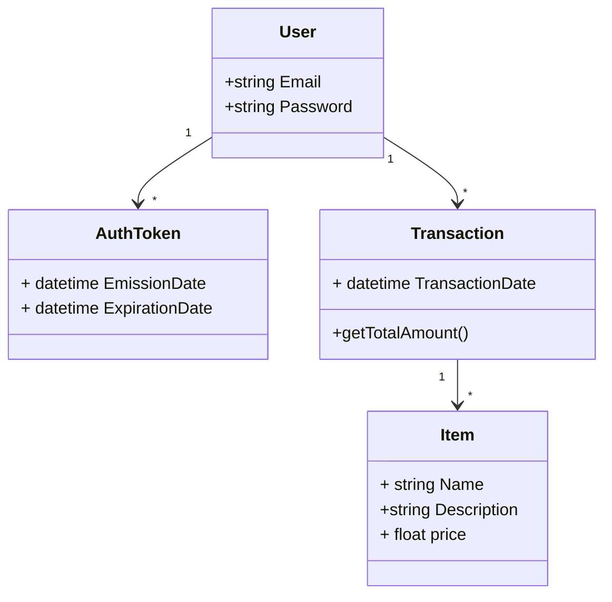

```mermaid

classDiagram

class User{
    +string Email
    +string Password

}
class AuthToken{
    + datetime EmissionDate
    + datetime ExpirationDate
}

class Transaction{
    + datetime TransactionDate
    +getTotalAmount()
}

class Item{
    + string Name
    +string Description
    + float price
}
User  "1"--> "*" AuthToken
User  "1"--> "*" Transaction
Transaction "1"--> "*" Item
```
