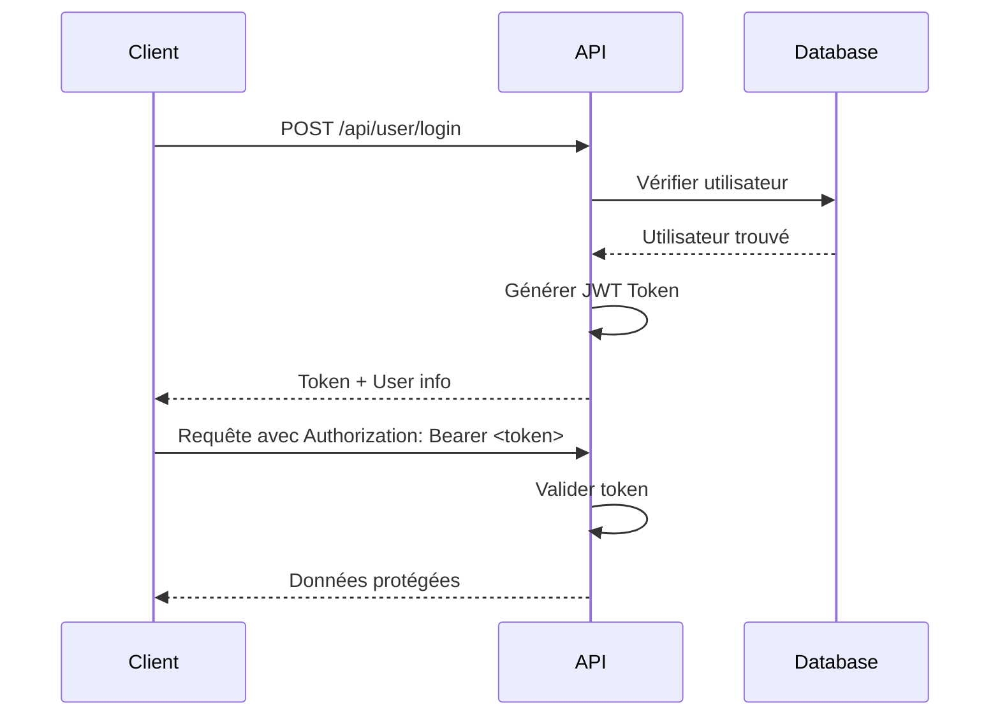

# Documentation Développeur - Micro-Transactions RPG

Une documentation complète pour comprendre, développer et maintenir l'application de micro-transactions RPG.

---

## Architecture Générale

### Vue d'Ensemble (Clean Architecture)
```
┌─────────────────────────────────────────────────────────┐
│                   Presentation Layer                      │
│                 (Controllers + DTOs)                     │
│                    Transaction.API                        │
└─────────────────────────────────────────────────────────┘
                              │
                              ▼
┌─────────────────────────────────────────────────────────┐
│                   Business Layer                         │
│              (Services Implementation)                   │
│                  Transaction.Business                     │
└─────────────────────────────────────────────────────────┘
                              │
                              ▼
┌─────────────────────────────────────────────────────────┐
│                    Core Layer                            │
│           (Entities + Interfaces + Config)              │
│                   Transaction.Core                       │
└─────────────────────────────────────────────────────────┘
                              │
                              ▼
┌─────────────────────────────────────────────────────────┐
│                    Data Layer                            │
│           (DbContext + Repositories + UoW)              │
│                    Transaction.Data                        │
└─────────────────────────────────────────────────────────┘
```

### Règles de Dépendance
- **Core** : Aucune dépendance externe (entités + interfaces)
- **Business** : Dépend de Core + Data (logique métier)
- **Data** : Dépend de Core (persistance)
- **API** : Dépend de Business + Core (presentation)

### Stack Technique
- **Frontend**: React 19 + TypeScript + Vite + Axios
- **Backend**: ASP.NET Core 8 + Entity Framework Core
- **Authentification**: JWT Bearer Tokens
- **Base de données**: SQL Server (LocalDB)
- **Architecture**: Clean Architecture (Layers)

---

## Structure des Projets

### Backend (`/Backend`)
```
Transaction.API/          # API Web - Presentation Layer
├── Controllers/          # Contrôleurs API
├── Program.cs           # Configuration et startup
├── appsettings.json     # Configuration JWT & DB

Transaction.Core/         # Core Layer - Contrats et Entités
├── Entities/            # Entités de données pures
├── DTOs/               # Objets de transfert
├── Interfaces/         # Contrats (interfaces uniquement)
│   ├── Services/        # Interfaces services (contrats)
│   └── Repositories/     # Interfaces repositories (contrats)
├── Configuration/      # Configuration (JWT, etc.)
├── Services/           # Services utilitaires (JWT uniquement)
└── Mapping/            # AutoMapper profiles

Transaction.Business/    # Business Layer - Logique Métier
└── Services/           # Implémentation services métier

Transaction.Data/         # Data Layer - Accès Données
├── Context/            # DbContext EF Core
├── Repositories/       # Implémentation repositories
└── UnitOfWork/         # Pattern Unit of Work
```

### Frontend (`/Frontend/src`)
```
src/
├── styles/             # Styles CSS
│   ├── App.css
│   ├── Layout.css
│   ├── Login.css
│   └── Dashboard.css
├── components/         # Composants réutilisables
│   └── Layout.tsx
├── pages/             # Pages principales
│   ├── Login.tsx
│   └── Dashboard.tsx
├── contexts/          # Contextes React
│   └── AuthContext.tsx
├── services/          # Services API
│   └── api.ts
├── config/            # Configuration
│   └── endpoints.ts
├── types/             # Types TypeScript
│   └── index.ts
└── assets/            # Ressources statiques
```

---

## Authentification JWT

### Flow d'Authentification


### Configuration JWT
```json
{
  "JwtSettings": {
    "SecretKey": "ThisIsMySecretKeyForJwtToken2024VerySecureKeyThatIsLongEnough",
    "Issuer": "TransactionAPI",
    "Audience": "TransactionClient",
    "ExpirationMinutes": 60
  }
}
```

### Claims Utilisés
- `NameIdentifier`: ID utilisateur
- `Name`: Nom d'utilisateur
- `Email`: Email utilisateur

---

## API Endpoints

### Utilisateurs
| Méthode | Endpoint | Description | Auth |
|---------|----------|-------------|------|
| POST | `/api/user/register` | Inscription utilisateur | ❌ |
| POST | `/api/user/login` | Connexion avec JWT | ❌ |
| GET | `/api/user` | Lister tous les utilisateurs | ✅ |
| GET | `/api/user/{id}` | Obtenir utilisateur par ID | ✅ |

### Transactions
| Méthode | Endpoint | Description | Auth |
|---------|----------|-------------|------|
| GET | `/api/transaction` | Lister transactions | ✅ |
| POST | `/api/transaction` | Créer transaction | ✅ |
| GET | `/api/transaction/{id}` | Transaction par ID | ✅ |
| GET | `/api/transaction/user/{id}` | Transactions utilisateur | ✅ |

### Items
| Méthode | Endpoint | Description | Auth |
|---------|----------|-------------|------|
| GET | `/api/item` | Lister items disponibles | ✅ |
| GET | `/api/item/{id}` | Item par ID | ✅ |

---

## Fonctionnalités Principales

### 1. Gestion des Utilisateurs
- **Inscription**: Création compte avec email/password
- **Connexion**: Authentification avec JWT
- **Profil**: Informations utilisateur

### 2. Système de Transactions
- **Création**: Sélection d'items pour transaction
- **Historique**: Visualisation transactions utilisateur
- **Calcul**: Total automatique des transactions

### 3. Gestion des Items
- **Catalogue**: Items disponibles à l'achat
- **Prix**: Prix unitaire par item
- **Description**: Détails des items

---

## Configuration & Développement

### Prérequis
- **.NET 8.0 SDK**
- **Node.js 18+**
- **SQL Server LocalDB**

### Installation Backend
```bash
cd Backend/Transaction.API
dotnet restore
dotnet build
dotnet run
# API disponible sur http://localhost:5000
# Swagger UI sur http://localhost:5000/swagger
```

### Installation Frontend
```bash
cd Frontend
npm install
npm run dev
# Frontend disponible sur http://localhost:5173
```

### Base de Données
```bash
# Créer migration
dotnet ef migrations add InitialCreate
# Appliquer migration
dotnet ef database update
```

---

## Patterns & Bonnes Pratiques

### Architecture Clean
- **Séparation des responsabilités**: Chaque couche a un rôle précis
- **Dependency Injection**: Injection via constructeur
- **Interface Segregation**: Interfaces spécifiques

### Frontend Patterns
- **Context API**: Gestion d'état globale (auth)
- **Custom Hooks**: Logique réutilisable
- **Type Safety**: TypeScript strict

### Sécurité
- **JWT Tokens**: Authentification stateless
- **Password Hashing**: BCrypt recommandé
- **CORS**: Configuration développement/production

---

## Conventions de Code

### Backend C#
```csharp
// Naming conventions
public class UserService : IUserService
{
    private readonly IUnitOfWork _unitOfWork;
    
    public async Task<ApiResponse<UserDto>> CreateUserAsync(CreateUserRequest request)
    {
        // Implementation
    }
}
```

### Frontend TypeScript
```typescript
// Types stricts
interface User {
  id: number;
  userName: string;
  email: string;
}

// Components avec props typées
const Login: React.FC = () => {
  // Implementation
};
```

---

## Déploiement

### Environment Variables
```bash
# Backend
ConnectionStrings__DefaultConnection="Server=...;Database=..."
JwtSettings__SecretKey="..."
JwtSettings__Issuer="..."
JwtSettings__Audience="..."

# Frontend
VITE_API_BASE_URL="https://api.example.com"
```


## 🐛 Débogage & Tests

### Points de Débogage
- **Swagger UI**: Tester endpoints API
- **Network Tab**: Vérifier requêtes HTTP
- **Console Logs**: Erreurs frontend
- **Application Logs**: Logs backend (.NET)

### Tests Recommandés
```bash
# Backend tests
dotnet test

# Frontend tests
npm test
```

---

## 🔄 Évolutions Possibles

### Court Terme
- [ ] Hashage mots de passe (BCrypt)
- [ ] Refresh Tokens
- [ ] Validation inputs côté client
- [ ] Tests unitaires

### Moyen Terme
- [ ] Rôles et permissions
- [ ] Notifications temps réel
- [ ] Export PDF transactions
- [ ] Analytics dashboard

### Long Terme
- [ ] Microservices architecture
- [ ] Multi-tenant
- [ ] Mobile app (React Native)
- [ ] Payment integration

---

#

## 📊 Performance & Monitoring

### Indicateurs Clés
- **Response Time**: < 200ms
- **Uptime**: > 99.9%
- **Error Rate**: < 1%
- **User Satisfaction**: > 4.5/5


---

## 🎓 Ressources d'Apprentissage

### Documentation Officielle
- [ASP.NET Core Docs](https://docs.microsoft.com/aspnet/core/)
- [React TypeScript Guide](https://react-typescript-cheatsheet.netlify.app/)
- [JWT Best Practices](https://auth0.com/blog/json-web-token-best-practices/)


---

*Document de référence pour le développement. Dernière mise à jour: Janvier 2026*
